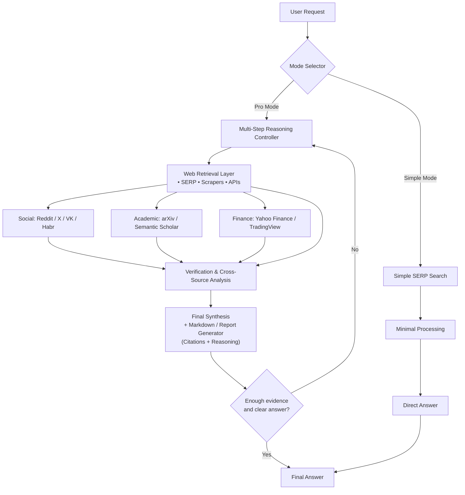

# OS_BOOTCAMP

```mermaid
graph TD
    A[User Request] --> B{Mode Selector}

    B -->|Simple Mode| S1[Simple SERP Search]
    S1 --> S2[Minimal Processing]
    S2 --> S3[Direct Answer]

    B -->|Pro Mode| P1[Multi-Step Reasoning Controller]

    P1 --> P2[Web Retrieval Layer<br/>• SERP • Scrapers • APIs]

    P2 --> P2A[Social: Reddit / X / VK / Habr]
    P2 --> P2B[Academic: arXiv / Semantic Scholar]
    P2 --> P2C[Finance: Yahoo Finance / TradingView]

    P2A --> P3[Verification & Cross-Source Analysis]
    P2B --> P3
    P2C --> P3
    P2  --> P3

    P3 --> P4["Final Synthesis<br/>+ Markdown / Report Generator<br/>(Citations + Reasoning)"]
    P4 --> D{Enough evidence<br/>and clear answer?}
    D -->|No| P1  
    D -->|Yes| OUT[Final Answer]

    S3 --> OUT
```
