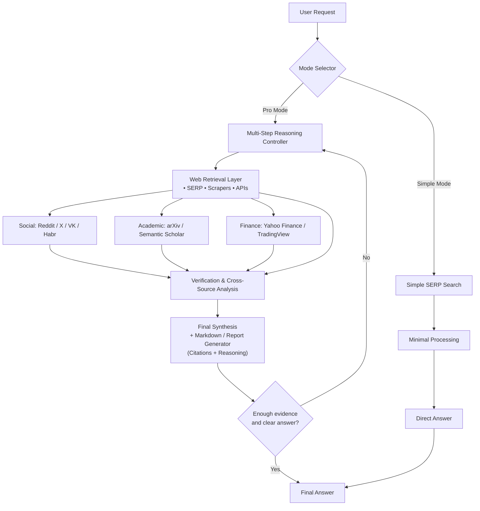

# TeraFinder

An intelligent multi-source information retrieval system that combines web search, social media, academic databases, and financial data to provide well-researched, verified answers with citations.

## Overview

TeraFinder is built on a **hexagonal architecture** (ports and adapters pattern) and uses **LangGraph** for orchestrating multi-step reasoning workflows. The system supports two modes:

- **Simple Mode**: Direct SERP search for quick answers
- **Pro Mode**: Multi-step reasoning with cross-source verification and synthesis

## Architecture Flow



## Project Structure

```
src/
├── domain/              # Core business logic (domain layer)
│   ├── models.py       # Data models (Query, Source, AgentState, etc.)
│   ├── ports.py        # Port interfaces (RetrievalPort, VerificationPort, etc.)
│   └── service.py      # Domain services
│
├── adapters/           # External integrations (adapter layer)
│   ├── retrieval/      # Data retrieval adapters
│   │   ├── serp_adapter.py       # Google/Bing search
│   │   ├── reddit_adapter.py     # Reddit posts
│   │   ├── twitter_adapter.py    # X (Twitter) posts
│   │   ├── academic_adapter.py   # arXiv, Semantic Scholar
│   │   ├── finance_adapter.py    # Yahoo Finance, TradingView
│   │   ├── scraper_adapter.py    # Generic web scraping
│   │   ├── social_adapter.py     # VK, Habr, etc.
│   │   └── orchestrator.py       # Coordinates all retrieval adapters
│   │
│   ├── verification/   # Data verification adapters
│   │   └── verifier.py           # Cross-source fact checking
│   │
│   ├── synthesis/      # Answer synthesis adapters
│   │   └── synthesizer.py        # Generates structured answers
│   │
│   ├── formatting/     # Output formatting adapters
│   │   └── markdown_formatter.py # Markdown/report generation
│   │
│   ├── tasks/          # Task management adapters
│   │   └── decomposer.py         # Query decomposition
│   │
│   ├── loop/           # Reasoning loop adapters
│   │   └── loop_controller.py    # Multi-step reasoning control
│   │
│   └── conversation/   # User interaction adapters
│       └── chat_agent.py         # Conversational interface
│
├── agents/             # LangGraph workflow nodes
│   └── nodes/
│       ├── conversation_node.py   # User interaction node
│       ├── decomposition_node.py  # Query decomposition node
│       ├── retrieval_node.py      # Data retrieval node
│       ├── verification_node.py   # Verification node
│       ├── synthesis_node.py      # Synthesis node
│       └── loop_node.py           # Loop control node
│
└── app/                # Application entry point
    └── main.py         # Chainlit UI / CLI entry
```

## Getting Started

### Prerequisites

- Python 3.13+
- [uv](https://github.com/astral-sh/uv) package manager (recommended) or pip

### Installation

1. **Clone the repository** (or your fork):
   ```bash
   git clone https://github.com/cbr4l0k/OS_BOOTCAMP.git
   cd OS_BOOTCAMP
   ```

2. **Install dependencies**:
   ```bash
   # Using uv (recommended)
   uv sync

   # Or using pip
   pip install -e .
   ```

3. **Set up environment variables**:
   Create a `.env` file in the project root:
   ```env
   OPENAI_API_KEY=your_api_key_here
   # Add other API keys as needed
   ```

### Running the Application

```bash
# Run the Chainlit UI
terafinder

# Or directly with Python
python -m src.app.main
```

## Development Guide

### For Team Members

If you're new to Git and contributing to this project, **read [INSTRUCTIONS.md](INSTRUCTIONS.md)** for a complete guide on:
- Forking the repository
- Creating branches
- Making changes
- Submitting pull requests

### Adding a New Adapter

All adapters implement port interfaces defined in `src/domain/ports.py`. To add a new retrieval source:

1. Create a new file in `src/adapters/retrieval/`
2. Implement the `RetrievalPort` protocol:
   ```python
   from ...domain.ports import RetrievalPort
   from ...domain.models import Query, RetrievedData, Source, SourceProvider

   class MyNewAdapter(RetrievalPort):
       @property
       def provider(self) -> SourceProvider:
           return SourceProvider.MY_SOURCE

       def retrieve(self, query: Query) -> RetrievedData:
           # Implementation here
           pass
   ```

3. Add your adapter to the orchestrator configuration
4. Write tests for your adapter

### Technology Stack

- **LangChain/LangGraph**: Orchestration framework for LLM-powered workflows
- **Pydantic**: Data validation and settings management
- **Chainlit**: Interactive UI for conversational applications
- **OpenAI API**: LLM provider for reasoning and synthesis

## Architecture Principles

### Hexagonal Architecture (Ports & Adapters)

- **Domain Layer** (`domain/`): Contains business logic, independent of external systems
- **Ports** (`domain/ports.py`): Interfaces that define contracts
- **Adapters** (`adapters/`): Implementations that connect to external systems

This design ensures:
- **Testability**: Easy to mock adapters for testing
- **Flexibility**: Swap implementations without changing domain logic
- **Maintainability**: Clear separation of concerns

### Why LangGraph?

LangGraph enables:
- **State Management**: Track query state across multiple reasoning steps
- **Conditional Routing**: Choose between Simple and Pro modes dynamically
- **Loops**: Iterate until sufficient evidence is gathered
- **Composability**: Build complex workflows from simple nodes

## Contributing

1. Read [INSTRUCTIONS.md](INSTRUCTIONS.md) for the Git workflow
2. Choose an adapter or feature to implement from the issues
3. Create a branch for your work
4. Implement and test your changes
5. Submit a pull request

## License

[Add your license here]

## Team

Built by the OS_BOOTCAMP team as a learning project for multi-agent systems and information retrieval.
